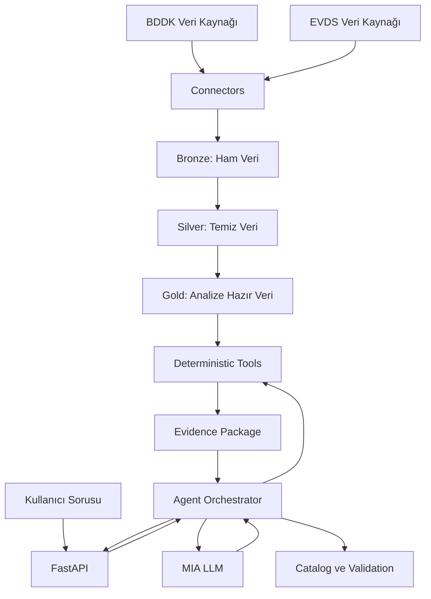

# Quad-Qore Sistem Mimarisi

## 1. Amaç

Quad-Qore, BDDK ve EVDS gibi güvenilir veri kaynaklarından alınan finansal verileri işleyerek kullanıcı sorularına doğrulanabilir analizler üretmeyi amaçlayan agentic data analytics platformudur.

Sistem, hesaplama ve veri işleme görevlerini mümkün olduğunca deterministik kodla gerçekleştirir. MIA üzerindeki LLM ise hazırlanmış ve doğrulanmış bulguları açıklamak için kullanılır.

## 2. Temel Mimari İlkesi

Projenin temel yaklaşımı **harness-first** tasarımdır.

- Veri indirme, temizleme, filtreleme ve hesaplama Python veya DuckDB ile yapılır.
- LLM doğrudan ham veriler üzerinde hesaplama yapmaz.
- LLM yalnızca izin verilen araçları kullanabilir.
- Sayısal sonuçlar araç çıktılarından alınır.
- Her önemli bulgu kaynak, seri ve tarih bilgisi taşımalıdır.
- LLM’nin temel görevi doğrulanmış sonuçları anlaşılır şekilde açıklamaktır.

Kısaca:

> Kod hesaplar ve doğrular; LLM planlamaya yardımcı olur ve sonucu anlatır.

## 3. Genel Mimari

## 4. Bileşenlerin Sorumlulukları

| Bileşen | Sorumluluğu | Yapmaması gereken |
|---|---|---|
| Connectors | BDDK ve EVDS verilerini almak | Analiz ve yorum üretmek |
| Bronze | Verinin ham halini saklamak | Ham veriyi değiştirmek |
| Silver | Tarihleri, sütunları ve veri tiplerini standartlaştırmak | Kullanıcıya doğrudan yorum sunmak |
| Gold | Analize hazır tablolar ve metrikler üretmek | LLM tarafından serbestçe değiştirilmek |
| Catalog | Kullanılabilir veri setlerini, serileri ve açıklamalarını tanımlamak | Sistemde olmayan seri uydurmak |
| Deterministic Tools | Filtreleme, karşılaştırma, toplama ve değişim hesaplama işlemlerini yapmak | Serbest metin yorumu üretmek |
| Agent Orchestrator | Araç çağrılarını yönetmek, girdileri doğrulamak ve kanıtları toplamak | LLM’nin kontrolsüz işlem yapmasına izin vermek |
| MIA LLM | Doğrulanmış bulguları açıklamak ve yanıtı anlaşılır hale getirmek | Sayısal değer veya kaynak uydurmak |
| FastAPI | Sisteme güvenli bir HTTP arayüzü sunmak | İş kurallarını kendi içinde hesaplamak |
| Evals | Sistemin beklenen davranışlarını ölçmek | Yalnızca güzel görünen cevabı başarılı saymak |

## 5. Uçtan Uca Veri Akışı

1. Connector, veriyi BDDK veya EVDS kaynağından alır.
2. Ham veri Bronze katmanına kaydedilir.
3. Silver katmanında veri temizlenir ve standartlaştırılır.
4. Gold katmanında analize uygun tablolar ve metrikler hazırlanır.
5. Kullanıcı sorusu FastAPI üzerinden sisteme gelir.
6. Agent Orchestrator soruyu ve parametreleri doğrular.
7. Gerekli deterministik araçlar çağrılır.
8. Araç sonuçlarından bir evidence package oluşturulur.
9. MIA LLM yalnızca bu kanıt paketini kullanarak açıklama üretir.
10. Orchestrator yanıtın kaynak ve veri sınırlarına uygunluğunu kontrol eder.
11. Sonuç kullanıcıya döndürülür.

## 6. Evidence Package

LLM’ye gönderilecek kanıt paketinde en az şu bilgiler bulunmalıdır:

- Kullanılan veri kaynağı
- Veri seti veya seri kimliği
- Seri açıklaması
- Başlangıç ve bitiş tarihi
- Kullanılan hesaplama yöntemi
- Hesaplanan sayısal değerler
- Eksik veri veya kalite uyarıları
- Kullanılan araçların isimleri

Bu yapı sayesinde LLM’nin cevabı sistem tarafından üretilen gerçek sonuçlara dayanır.

## 7. Güvenilirlik Kuralları

- Aynı veri ve aynı parametreler aynı sayısal sonucu üretmelidir.
- Sistem, bulunmayan bir seri veya veri setini uydurmamalıdır.
- Belirsiz kullanıcı sorularında açıklama istenmelidir.
- Eksik veri varsa bu durum yanıtta açıkça belirtilmelidir.
- API anahtarları hiçbir log, yanıt veya evidence package içine eklenmemelidir.
- LLM çıktısı tek başına doğruluk kaynağı kabul edilmemelidir.
- Desteklenmeyen analizlerde sistem kontrollü hata döndürmelidir.

## 8. İlk Sürüm Kapsamı

İlk uçtan uca sürümde:

- Sınırlı sayıda BDDK veri seti kullanılacak.
- Sınırlı sayıda EVDS serisi kullanılacak.
- Tarih aralığına göre veri filtreleme desteklenecek.
- Yüzdesel değişim ve dönem karşılaştırması yapılabilecek.
- Sonuçlar kaynak bilgisiyle birlikte döndürülecek.
- İlk demo senaryosu baştan sona çalıştırılacak.
- Golden evaluation senaryoları ile temel davranışlar kontrol edilecek.

Yeni veri kaynakları ve analiz türleri, ilk çalışan sürüm tamamlandıktan sonra sisteme eklenecektir.

## 9. Açık Kararlar

Aşağıdaki konular ekip araştırmaları tamamlandıkça netleştirilecektir:

- Kullanılacak kesin BDDK veri setleri
- Kullanılacak kesin EVDS seri kodları
- Connector veri alma yöntemleri
- Tool giriş ve çıkış sözleşmeleri
- Evidence package Pydantic modeli
- İlk demo analizinin kesin metrikleri