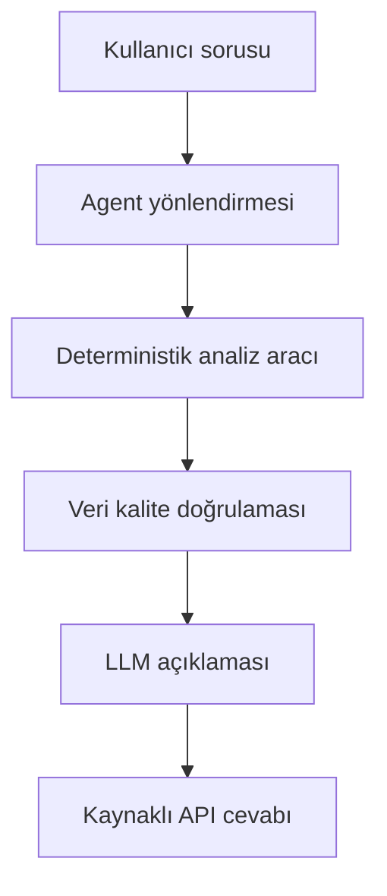

# İlk Uçtan Uca Demo Senaryosu

## 1. Amaç

Bu belge, Quad-Qore Agentic Analytics platformunun ilk uçtan uca demo
senaryosunu tanımlar.

Senaryonun amacı; BDDK ve TCMB EVDS verilerini kullanarak Türkiye'deki konut
kredisi gelişimini deterministik hesaplamalarla analiz etmek ve hesaplanan
sonuçları bir dil modeli aracılığıyla açıklamaktır.

Dil modeli veri indirmeyecek veya sayısal hesaplama yapmayacaktır. Bütün
hesaplamalar doğrulanabilir Python araçları tarafından gerçekleştirilecektir.

## 2. Kullanıcı Sorusu

İlk demo aşağıdaki doğal dil sorusunu cevaplayacaktır:

> 2021-2025 döneminde Türkiye'deki konut kredisi bakiyesi; konut kredisi
> faizleri, tüketici enflasyonu ve konut fiyatlarıyla birlikte nasıl değişti?

## 3. Analiz Kapsamı

- Başlangıç dönemi: `2021-01`
- Bitiş dönemi: `2025-12`
- Beklenen dönem sayısı: `60 ay`
- Coğrafi kapsam: Türkiye geneli
- Zaman frekansı: Aylık
- Para birimi: TL
- BDDK tutar birimi: Milyon TL

Kaynaklarda 2026 yılına ait veriler saklanabilir ancak ilk demo yalnızca
2021-2025 arasındaki 60 tamamlanmış ayı kullanacaktır.

## 4. Kullanılacak Veriler

| Kaynak | Seri veya tablo | Ham frekans | Demo alanı |
|---|---|---:|---|
| BDDK Aylık Bülten | Tablo 4, Sektör `10001`, TL, `Tüketici Kredileri - Konut` | Aylık | `nominal_housing_loan_mn_try` |
| TCMB EVDS | `TP.KTF12` | Haftalık | `housing_loan_interest_rate_pct` |
| TCMB EVDS | `TP.TUKFIY2025.GENEL` | Aylık | `cpi_index` |
| TCMB EVDS | `TP.KFE.TR` | Aylık | `housing_price_index` |

`TP.KTF12`, yeni kullandırılan konut kredilerinin akım faiz oranını temsil
eder. Mevcut bütün konut kredilerinin ortalama maliyeti olarak
yorumlanmayacaktır.

Konut Fiyat Endeksi kredi tutarını enflasyondan arındırmak için
kullanılmayacaktır. Bu işlem yalnızca TÜFE serisiyle yapılacaktır.

## 5. Deterministik Dönüşümler

Bütün dönüşümler kod tarafından yapılacaktır.

### 5.1. Faizin aylıklaştırılması

Haftalık konut kredisi faizleri gözlem tarihinin bulunduğu aya atanır.

Her ay için:

```text
aylık faiz = ay içerisindeki geçerli haftalık faizlerin aritmetik ortalaması
```

Her aylık kayıtta kullanılan haftalık gözlem sayısı da saklanacaktır.

### 5.2. Reel kredi tutarı

TÜFE serisinin baz yılı `2025=100` olduğu için reel kredi tutarı şu şekilde
hesaplanacaktır:

```text
reel kredi = nominal kredi × 100 / TÜFE endeksi
```

Sonuç `real_housing_loan_2025_mn_try` alanında ve 2025 fiyatlarıyla milyon TL
olarak tutulacaktır.

### 5.3. Aylık birleştirme

Dört seri `YYYY-MM` biçimindeki `period` alanı üzerinden bire bir
birleştirilecektir.

Birleştirme sonucunda beklenen temel alanlar:

- `period`
- `nominal_housing_loan_mn_try`
- `real_housing_loan_2025_mn_try`
- `housing_loan_interest_rate_pct`
- `weekly_observation_count`
- `cpi_index`
- `housing_price_index`

### 5.4. Türetilmiş göstergeler

Kod tarafından aşağıdaki göstergeler hesaplanabilir:

- Nominal konut kredisi aylık değişim oranı
- Reel konut kredisi aylık değişim oranı
- Konut kredisi faizindeki aylık puan değişimi
- TÜFE endeksindeki aylık değişim oranı
- Konut Fiyat Endeksi aylık değişim oranı
- Analiz dönemindeki en yüksek ve en düşük reel kredi değişim ayları

Korelasyon hesaplanırsa nedensellik olarak yorumlanmayacaktır.

## 6. Veri Kalitesi Kuralları

Analiz aracı başarılı sonuç üretmeden önce aşağıdaki koşulların tamamını
doğrulamalıdır:

1. `2021-01` ile `2025-12` arasındaki 60 ay eksiksiz bulunmalıdır.
2. `period` alanı sıralı ve benzersiz olmalıdır.
3. Temel analiz alanlarında eksik değer bulunmamalıdır.
4. Sayısal alanlar gerçekten sayısal olmalıdır.
5. Kredi tutarı, faiz, TÜFE ve KFE değerleri negatif olmamalıdır.
6. Her ay için en az bir geçerli haftalık faiz gözlemi bulunmalıdır.
7. Kaynak dosya, seri kodu, dönem ve indirme zamanı izlenebilir olmalıdır.
8. Aynı girdiler her çalıştırmada aynı hesaplama sonucunu üretmelidir.

Bu kurallardan biri sağlanmazsa sistem eksik veriyi sessizce atmayacak ve
başarılı analiz üretmeyecektir.

## 7. Agent ve LLM Sorumlulukları

Agent:

- Kullanıcı sorusunun konut kredisi analiz aracıyla ilişkili olduğunu belirler.
- Başlangıç ve bitiş dönemlerini doğrular.
- Uygun deterministik aracı çağırır.
- Araç sonucunu veri kalite kontrolünden geçirir.
- Doğrulanan sonucu dil modeline aktarır.

Dil modeli:

- Yalnızca araç tarafından sağlanan doğrulanmış değerleri açıklar.
- Yeni değer hesaplamaz veya uydurmaz.
- Eksik veri varsa bunu açıkça belirtir.
- Korelasyonu nedensellik olarak sunmaz.
- Kullanılan dönemleri ve kaynakları cevabında gösterir.

## 8. Beklenen Çıktı

Başarılı demo cevabı aşağıdaki parçaları içermelidir:

- Kullanıcı sorusuna kısa doğal dil cevabı
- Analiz dönemi
- Kullanılan veri kaynakları ve seri kodları
- Temel başlangıç ve bitiş değerleri
- En dikkat çekici değişim ayları
- Aylık zaman serisi grafiği
- Yapılan dönüşümlerin kısa açıklaması
- Veri uyarıları ve sınırlamalar
- Kaynak ve provenance bilgileri

## 9. Kontrollü Hata Durumları

Aşağıdaki durumlarda sistem tahmin yürütmek yerine kontrollü hata
döndürmelidir:

- İstenen dönem desteklenen veri aralığının dışındaysa
- Herhangi bir kaynakta ay eksikse
- Aynı ay birden fazla kez bulunuyorsa
- Ham değer sayısal değilse
- Veri kaynağı veya provenance bilgisi bulunamıyorsa
- Haftalık faiz aylıklaştırılamıyorsa
- Veri setleri ortak bir aylık kapsama getirilemiyorsa

## 10. Harness Akışı



Bu akışta dil modeli yalnızca yönlendirme ve açıklama katmanındadır.
Veri erişimi, birleştirme, hesaplama ve doğrulama kod tarafından yapılır.

## 11. Kabul Kriterleri

İlk demo aşağıdaki koşullar sağlandığında tamamlanmış kabul edilecektir:

- 2021-2025 için tam 60 aylık doğrulanmış tablo üretilmesi
- BDDK ve üç EVDS serisinin dönem bazında birleştirilmesi
- Reel kredi tutarının kodla hesaplanması
- Eksik ve mükerrer dönem testlerinin geçmesi
- Aynı girdinin aynı sayısal çıktıyı üretmesi
- Sayısal iddiaların araç çıktısıyla eşleşmesi
- Cevapta kullanılan kaynakların gösterilmesi
- MIA modelinin araç sonucunu uydurma değer eklemeden açıklayabilmesi
- Akışın FastAPI üzerinden çalıştırılabilmesi

## 12. İlk Demo Dışındaki Konular

Aşağıdakiler ilk demo kapsamına dahil değildir:

- Gelecek dönem tahmini
- Bireysel kredi veya müşteri verisi
- Kredi skorlama ya da kredi kararı
- Yatırım tavsiyesi
- Nedensellik iddiası
- Türkiye dışındaki konut piyasaları
- Serbest biçimli SQL çalıştırılması