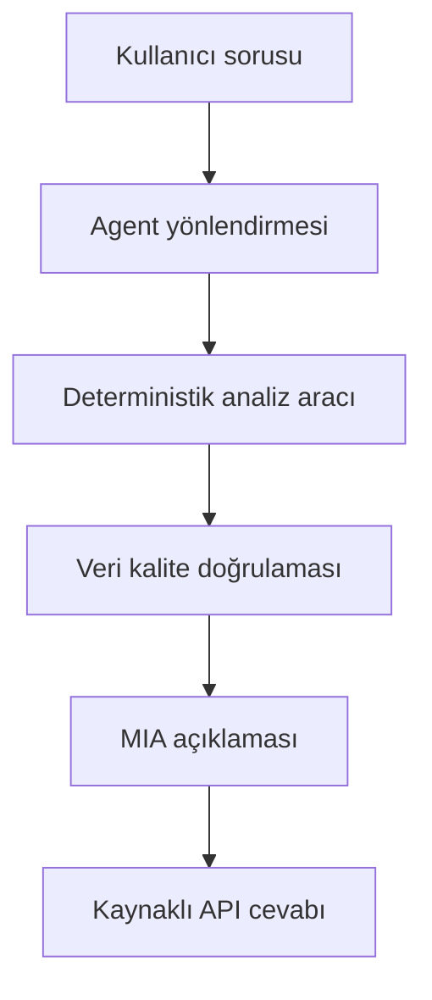

# İlk Uçtan Uca Demo Senaryosu

**Durum:** Aktif sözleşme
**Sorumlu:** Mustafa Ekinci
**İlgili issue:** #1

## 1. Amaç

Bu belge, Quad-Qore platformunun ilk uçtan uca çalışan demo senaryosunu
tanımlar.

Amaç; BDDK ve TCMB EVDS verilerini güvenilir biçimde bir araya getirmek,
sayısal işlemleri deterministik Python araçlarıyla yapmak ve doğrulanmış
sonuçları Kloudeks MIA modeliyle kullanıcıya anlaşılır biçimde açıklamaktır.

Dil modeli ham veriden kendi başına hesaplama yapmayacak veya kaynakta olmayan
değer üretmeyecektir.

## 2. Ana kullanıcı sorusu

> 2021-2025 döneminde konut kredisi faizinin düştüğü hâlde reel konut kredisi
> tutarının artmadığı ayları bul; bu dönemleri TÜFE ve Konut Fiyat Endeksi
> bağlamında karşılaştır ve nedensellik iddiası kurmadan açıkla.

Bu soru hem belirli bir koşulu deterministik olarak bulmayı hem de hesaplanan
sonuçları ekonomik göstergelerle birlikte açıklamayı gerektirir.

## 3. İlk sürümün kapsamı

- Başlangıç dönemi: `2021-01`
- Bitiş dönemi: `2025-12`
- Hedef frekans: Aylık
- Beklenen gözlem sayısı: 60 ay
- Coğrafi kapsam: Türkiye geneli
- Para birimi: TL
- BDDK tutar birimi: Milyon TL

Kaynaklarda 2026 yılına ait veriler saklanabilir ancak ilk demo yalnızca
2021-2025 arasındaki 60 tamamlanmış ayı kullanacaktır.

## 4. Veri anlamı

BDDK konut kredisi tutarı ile EVDS konut kredisi faiz oranı aynı tür ölçüm
değildir.

- BDDK aylık konut kredisi tutarı bir **stok** büyüklüğüdür.
- EVDS `TP.KTF12`, yeni kullandırılan konut kredilerine ilişkin haftalık
  **akım faiz oranıdır**.
- TÜFE, nominal kredi stokunu 2025 fiyatlarıyla reel hâle getirmek için
  kullanılır.
- Konut Fiyat Endeksi (KFE), konut fiyatlarının seyrini karşılaştırmak için
  kullanılır; kredi tutarının deflatörü değildir.

Bu göstergeler birlikte incelenecek ancak aralarında otomatik nedensellik
kurulmayacaktır.

## 5. Veri kaynakları

| Veri | Kaynak | Seri veya tablo | Ham frekans | Demo alanı |
|---|---|---|---:|---|
| Toplam konut kredisi tutarı | BDDK Aylık Bülten | Tablo 4, Sektör `10001`, TL, `Tüketici Kredileri - Konut` | Aylık | `nominal_housing_loan_mn_try` |
| Konut kredisi faiz oranı | TCMB EVDS | `TP.KTF12` | Haftalık | `housing_loan_interest_rate_pct` |
| Tüketici Fiyat Endeksi | TCMB EVDS | `TP.TUKFIY2025.GENEL`, 2025=100 | Aylık | `cpi_index` |
| Konut Fiyat Endeksi | TCMB EVDS | `TP.KFE.TR`, 2023=100 | Aylık | `housing_price_index` |

Her kaynak için aşağıdaki provenance bilgileri korunmalıdır:

- Kaynak kurum ve adres
- Seri kodu veya tablo adı
- Açıklama, birim ve ham frekans
- Kullanılan tarih aralığı
- İndirme zamanı
- Ham dosya özeti (SHA-256)
- Uygulanan dönüşümler

## 6. Veri katmanları

### Bronze

Kaynak yanıtları mümkün olduğunca değiştirilmeden saklanır. Kaynak adresi,
istek parametreleri, indirme zamanı, dosya boyutu ve SHA-256 özeti makbuzla
birlikte korunur.

### Silver

Her kaynak kendi içinde temizlenir ve standartlaştırılır:

- Tarih ve dönem normalizasyonu
- Sayısal değer dönüşümü
- Şema ve birim kontrolü
- Haftalık faizin aylıklaştırılması
- Eksik ve mükerrer dönem doğrulaması
- Standart sütun adları

### Gold

Doğrulanmış BDDK ve EVDS Silver tabloları `period` alanı üzerinden birleştirilir.
Demo Gold tablosu `2021-01` ile `2025-12` arasındaki 60 ayı içermelidir.

## 7. Deterministik hesaplama kuralları

### 7.1. Faiz oranının aylıklaştırılması

Haftalık `TP.KTF12` gözlemleri, gözlem tarihinin bulunduğu aya atanır:

```text
monthly_interest_rate = mean(weekly_interest_rates_in_month)
```

Her ay için kullanılan haftalık gözlem sayısı da saklanır.

### 7.2. Reel kredi tutarı

TÜFE serisi `2025=100` bazlı olduğundan:

```text
real_housing_loan_2025_mn_try =
    nominal_housing_loan_mn_try * 100 / cpi_index
```

### 7.3. Kredi tutarındaki aylık değişim

Nominal ve reel kredi için aynı değişim formülü uygulanır:

```text
monthly_change_pct =
    ((current_value - previous_value) / previous_value) * 100
```

### 7.4. Faiz oranındaki aylık değişim

Faiz değişimi yüzde değişim olarak değil, yüzde puan olarak hesaplanır:

```text
interest_rate_change_pp =
    current_interest_rate - previous_interest_rate
```

### 7.5. Ana koşul

```text
rate_down_real_credit_not_up =
    interest_rate_change_pp < 0
    AND real_housing_loan_change_pct <= 0
```

İlk ay için önceki değer bulunmadığından değişim alanları ve koşul sonucu
`null` olacaktır.

## 8. Gold tablo sözleşmesi

| Alan | Açıklama |
|---|---|
| `period` | Ay, `YYYY-MM` biçiminde |
| `nominal_housing_loan_mn_try` | Nominal konut kredisi stoku |
| `real_housing_loan_2025_mn_try` | 2025 fiyatlarıyla reel kredi stoku |
| `nominal_housing_loan_change_pct` | Nominal stokun aylık değişimi |
| `real_housing_loan_change_pct` | Reel stokun aylık değişimi |
| `housing_loan_interest_rate_pct` | Aylıklaştırılmış konut kredisi faizi |
| `weekly_observation_count` | Aylık ortalamada kullanılan haftalık gözlem sayısı |
| `interest_rate_change_pp` | Faizin aylık yüzde puan değişimi |
| `cpi_index` | TÜFE genel endeksi, 2025=100 |
| `housing_price_index` | Türkiye KFE, 2023=100 |
| `rate_down_real_credit_not_up` | Ana koşul sonucu |
| `bddk_source_ref` | BDDK kaynak referansı |
| `evds_source_refs` | Kullanılan EVDS seri referansları |
| `data_quality_note` | Veri kalitesi uyarıları |

## 9. Veri kalitesi ve hata politikası

Başarılı demo sonucu üretilmeden önce şu koşulların tamamı doğrulanmalıdır:

1. `2021-01` ile `2025-12` arasındaki 60 ay eksiksiz bulunmalıdır.
2. `period` alanı sıralı ve benzersiz olmalıdır.
3. Temel analiz alanlarında eksik değer bulunmamalıdır.
4. Sayısal alanlar gerçekten sayısal ve negatif olmayan değerler içermelidir.
5. Her ay için en az bir geçerli haftalık faiz gözlemi bulunmalıdır.
6. Veri kaynağı, seri kodu, dönem ve ham dosya izlenebilir olmalıdır.
7. Ham dosyanın SHA-256 özeti makbuzla eşleşmelidir.
8. Aynı girdiler aynı hesaplama sonucunu üretmelidir.

Eksik veya mükerrer dönemler sessizce atılmayacak, doldurulmayacak ve başarılı
analiz olarak sunulmayacaktır. İnterpolasyon ilk demo kapsamında yapılmayacaktır.

## 10. Harness-first görev ayrımı

### Python araçlarının sorumlulukları

- Kaynak dosyalarını indirmek veya okumak
- Ham yanıtları ayrıştırmak
- Tarihleri ve sütunları standartlaştırmak
- Haftalık veriyi aylık frekansa dönüştürmek
- Serileri `period` üzerinden birleştirmek
- Reel tutarları ve değişimleri hesaplamak
- Ana koşula uyan ayları belirlemek
- Veri kalitesi ve çıktı şemasını doğrulamak
- Kaynak ve dönüşüm bilgilerini saklamak

### Agent ve LLM sorumlulukları

- Kullanıcının amacını anlamak
- Yalnızca tanımlı ve izinli araçlardan uygun olanı seçmek
- Başlangıç ve bitiş dönemlerini doğrulamak
- Doğrulanmış araç sonucunu açıklamak
- Kaynakları ve analizin sınırlarını göstermek

LLM:

- Ham veriden kendi başına sayısal sonuç üretmemelidir.
- Kaynakta bulunmayan değer uydurmamalıdır.
- Python tarafından hesaplanan değerleri değiştirmemelidir.
- Korelasyonu nedensellik olarak sunmamalıdır.
- Tanımlanmamış bir aracı çağırmamalıdır.

## 11. Beklenen çalışma akışı



## 12. Beklenen kullanıcı çıktısı

- Koşula uyan ayların listesi
- İlgili aylardaki nominal ve reel kredi tutarları
- Kredi tutarı ve faiz değişimleri
- TÜFE ve KFE bağlamı
- Zaman serisi grafiği
- Kullanılan BDDK ve EVDS kaynakları
- Aylıklaştırma ve reel hesaplama yöntemleri
- Eksik veya şüpheli veri uyarıları
- Korelasyon ve nedensellik sınırlaması

## 13. Kontrollü hata durumları

Sistem aşağıdaki durumlarda tahmin yürütmek yerine kontrollü hata döndürmelidir:

- İstenen dönem desteklenen aralığın dışındaysa
- Herhangi bir kaynakta ay eksikse
- Aynı ay birden fazla kez bulunuyorsa
- Ham değer sayısal değilse
- Kaynak veya provenance bilgisi bulunamıyorsa
- Ham dosya özeti makbuzla eşleşmiyorsa
- Haftalık faiz aylıklaştırılamıyorsa
- Veri setleri ortak aylık kapsama getirilemiyorsa

## 14. Kabul kriterleri

İlk demo şu koşullar sağlandığında tamamlanmış kabul edilir:

- 2021-2025 için tam 60 aylık doğrulanmış Gold tablo üretilmesi
- BDDK ve üç EVDS serisinin dönem bazında birleştirilmesi
- Reel kredi tutarının deterministik kodla hesaplanması
- Eksik ve mükerrer dönem testlerinin geçmesi
- Ana koşula uyan ayların kodla belirlenmesi
- Aynı girdinin aynı sayısal çıktıyı üretmesi
- Bütün sayısal iddiaların araç çıktısıyla eşleşmesi
- Kaynak ve provenance bilgilerinin gösterilmesi
- MIA modelinin araç sonucuna yeni değer eklemeden açıklama üretmesi
- Akışın FastAPI üzerinden çalıştırılabilmesi

## 15. İlk sürüm dışında kalanlar

- İl bazlı FinTürk karşılaştırmaları
- Tahmin modeli geliştirme
- Otomatik ekonomik nedensellik iddiası
- Bireysel kredi veya müşteri verisi
- Kredi skorlama veya kredi kararı
- Yatırım tavsiyesi
- Çok sayıda kredi türünü aynı anda analiz etme
- Kullanıcıya serbest SQL veya sınırsız araç çalıştırma yetkisi
- Modelin doğrudan ham veriyi değiştirmesi

## 16. Uygulama öncesi son doğrulamalar

- [ ] BDDK aylık `toplam` alanının ekonomik anlamını örnek dönemlerle insan kontrolünden geçirmek
- [ ] `TP.KTF12` aylık ortalamasının gerçek EVDS dosyasında 60 ayı eksiksiz ürettiğini doğrulamak
- [ ] TÜFE ve KFE baz yıllarını kaynak metadata bilgileriyle kaydetmek
- [ ] BDDK ve EVDS Silver tablolarının ortak `period` sözleşmesini test etmek
- [ ] Gold şeması ve agent araç çıktısı için Pydantic modellerini kesinleştirmek
